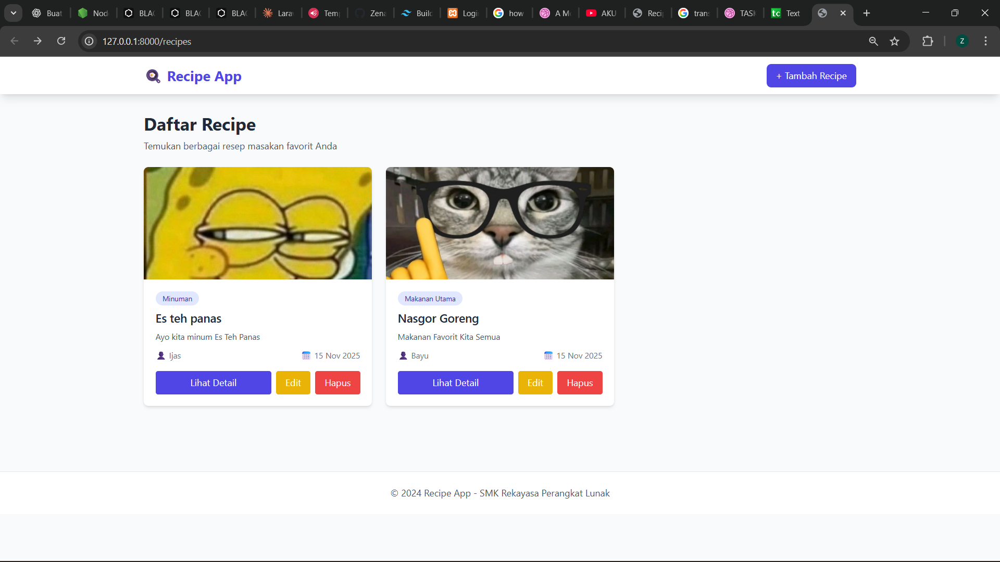
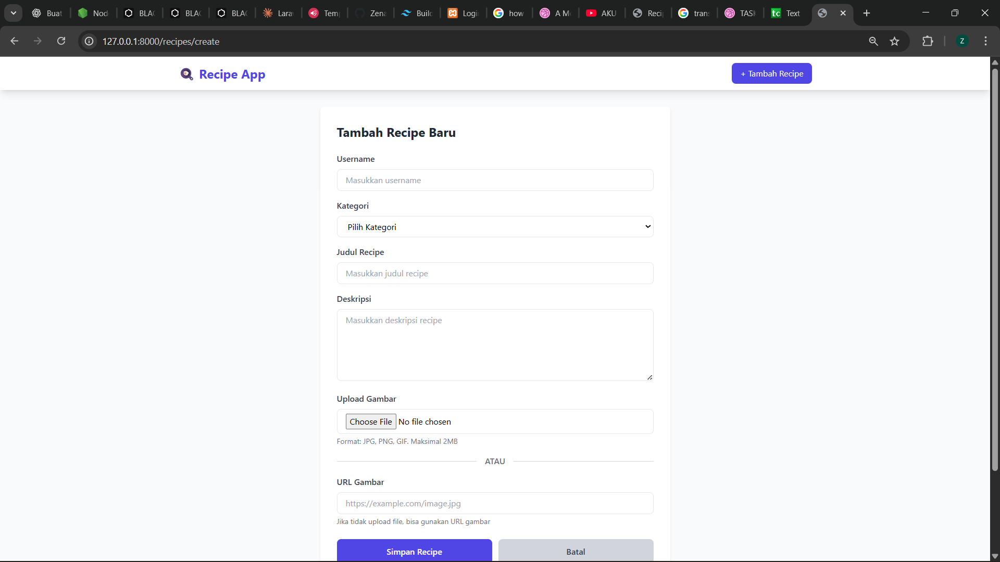
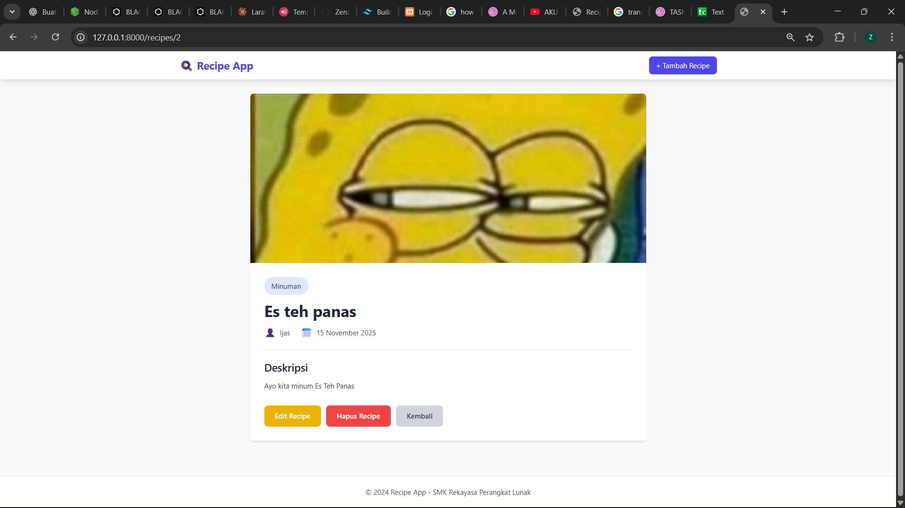

# Recipe App

Aplikasi web management resep masakan menggunakan Laravel 11, MySQL, dan Tailwind CSS.

## Fitur
- ✅ CRUD Recipe (Create, Read, Update, Delete)
- ✅ Upload gambar dari file lokal atau URL
- ✅ Kategori recipe
- ✅ Pagination
- ✅ Responsive design dengan Tailwind CSS

## Teknologi
- Laravel 11
- MySQL
- Tailwind CSS 3.4
- PHP 8.2+

## Instalasi

### 1. Clone Repository
```bash
git clone https://github.com/username/recipe-app.git
cd recipe-app
```

### 2. Install Dependencies
```bash
composer install
npm install
```

### 3. Konfigurasi Environment
```bash
cp .env.example .env
php artisan key:generate
```

Edit file `.env` dan sesuaikan konfigurasi database:
```env
DB_DATABASE=recipe_app
DB_USERNAME=root
DB_PASSWORD=
```

### 4. Buat Database
Buat database baru bernama `recipe_app` di MySQL

### 5. Migrasi Database
```bash
php artisan migrate
```

### 6. Buat Storage Link
```bash
php artisan storage:link
```

### 7. Build Assets
```bash
npm run build
```
Atau untuk development:
```bash
npm run dev
```

### 8. Jalankan Server
```bash
php artisan serve
```

Buka browser: `http://localhost:8000`

## Screenshot

### Halaman Daftar Recipe


### Form Tambah Recipe


### Detail Recipe


## Struktur Database

### Tabel: recipes
| Field | Type | Description |
|-------|------|-------------|
| id_recipe | bigint | Primary Key |
| username | varchar(255) | Nama user |
| category | varchar(255) | Kategori recipe |
| title | varchar(255) | Judul recipe |
| description | text | Deskripsi recipe |
| image_url | varchar(255) | URL gambar (nullable) |
| image_path | varchar(255) | Path upload gambar (nullable) |
| created_at | timestamp | Waktu dibuat |
| updated_at | timestamp | Waktu diupdate |

## License
Open-source

## Author
Siswa SMK Rekayasa Perangkat Lunak